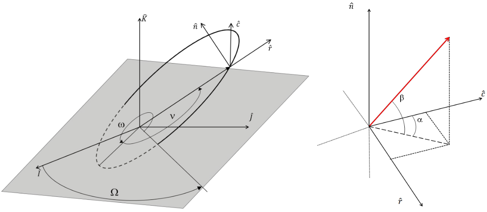

# Modelamiento de dinámica orbital de cubesat 3U para determinación de costos propuslivos, energéticos y temporales en maniobras orbitales de bajo empuje predeterminados
### Explicación del código implementado a la fecha:
Se han implementado 5 archivos:
- <strong>constants.py:</strong> en éste código se definen todas las constantes a ser usadas en el resto del código como las constantes gravitacionales estándares de la Tierra, el Sol y la Luna, el radio de la Tierra, la constante de gravedad y las masas de la Tierra, la Luna y el Sol, entre otras.
- <strong>coordinates.py:</strong> en éste código se definen funciones que son de ayuda para transformar las coordenadas de keplerianas a cartesianas, de cartesianas a keplerianas a cartesianas, de keplerianas a equinocciales, de equinocciales a keplerianas, de cartesianas a queinocciales y de equinocciales a cartesianas.
- <strong>models.py:</strong> en éste código se definen clases y funciones que conforman los modelos físicos a utilizar, como por ejemplo el modelo de densidad atmosférica, el modelo de posición Lunar y solar, y finalemente los modelos utilizados en el satélite, como los modelos de propulsores, los modelos de paneles solares, baterías, energía y los modelos de satélite en sí (incorporando cosas como masa, coeficiente balístico, etc). La idea es que acá se vayan agregando los modelos que sean distintos o más complejos en el tiempo.
- <strong>maneuvers.py:</strong> en éste código se encuentra las funciones que realizan el trabajo de calcular la dinámica orbital, y las funciones con las que interactúa el usuario para poder añadir las perturbaciones que desee y propagar el movimiento por el tiempo que se desee. En éste caso también se definen varios métodos de integración del movimiento del satélite, como el método de Conwell, el de Gauss y el de Betts. Un objeto \textit{Maneuver}, va calculando la trayectoria aplicada sobre él y guardandola en un historial que sirve para ser utilizado más tarde.
- <strong>auxiliary.py:</strong> en éste código se definen funciones auxiliares o misceláneas que tienen como propósito facilitar la interacción del usuario. En este momento sólo se tiene un extractor de elementos a partir de un TLE un una funcíón para facilitar la mantención del aspect ratio al graficar en 3D.

### Modo de uso:
En primer lugar se debe declarar el modelo de <i>spacecraft</i>, los elementos orbitales asociados a él y la fecha a la cual pertenecen dichos elementos orbitales.
Si bien en el ejemplo de abajo se obtienen a partir de un TLE, se pueden definir manualmente.
`coe` corresponde a los elementos orbitales expresados de manera kepleriana y en una lista de orden `[a,e,i,omega,Omega,M]`. La fecha simplemente es un `datetime`.  

Si se escoge utilizar un propulsor o paneles solares es necesario definirlos en `Spacecraft.thruster` y `Spacecraft.solarPanels`, ambos pueden ser definidos de manera genérica mediante models.Thruster y models.solarPanels,respectivamente, o bien mediante un modelo que haya disponible en models.py.
Éstos parámetros son pasados al constructor del objeto Maneuvers, para definir el estado inicial de la maniobra.
```python
coe,date = helpers.parseTle("suchai0.tle")
# Spacecraft Definition
satellite = models.Cubesat("3U")

# Thruster Definition (1uN thrust, 720s Isp)
satellite.thruster = models.Thruster(thrust=1e-3,isp=720)

#Solar Panels Definition
satellite.solarPanels = models.solarPanel()
satellite.solarPanels.area = 30e-2*30e-2
satellite.solarPanels.efficiency = 0.4

#Define maneuvers object
maneuvers = Maneuvers(coe,satellite,date)
```
Luego podemos agregar las perturbaciones al objeto maneuvers para agregar las perturbaciones (hasta ahora se ha implementado `atmosphere`, `solar_pressure`, `moon_gravity`, `sun_gravity`, `J2` y `thrust`)
El método `propagate` propaga en el tiempo y acepta el tiempo en segundos, y un timestep en segundos.
```python
# Add solar pressure and atmospheric drag perturbations to maneuver
maneuvers.addPerturbation("solar_pressure")
maneuvers.addPerturbation("atmosphere")
# Propagate 1 day 
maneuvers.propagate(60*60*24*1, 60)
# Start thrust
maneuvers.addPerturbation("thrust")
# Propagate for 18 days
maneuvers.propagate(60*60*24*18, 60)
# Stop thrust
maneuvers.removePerturbation("thrust")
# Propagate for 1 day
maneuvers.propagate(60*60*24*1, 60)
```
Para orientar el empuje es posible definir funciones de callback que acepten coe como entrada, y entreguen ángulos alpha y beta de orientación definidos en el sistema de referencia rsw del satélite:

```
def alphaCallback(coe):
    # Alpha is such that is always pointing in the direction of velocity
    e = coe[1]
    nu = coe[5]
    alpha = np.arctan2(e*np.sin(nu),1+e*np.cos(nu))
    return alpha

def betaCallback(coe):
    # Beta is always 30 deg w/r to rsw frame
    return 30*np.pi/180

maneuver.addPerturbation("thrust")
maneuver.thrustProfile = (alphaCallback,betaCallback)
maneuver.propagate(60*60*24*10,60)
```
Varios ejemplos de lo anterior pueden verse en <a href="https://github.com/MrPapasFritas/frames-days/blob/master/Demo - Single Orbital Parameter Modification.ipynb">éste demo</a>  

También se ha implementado un método para imponer una órbita objetivo y que el empuje sea calculado de manera de llegar a aquella órbita:
```
# Add thrust
maneuvers.addPerturbation("thrust")
# Set Target Orbit
targetOrbitElements = [50000e3,0.01,10*np.pi/180,None,None]
maneuvers.setTargetOrbit(targetOrbitElements)
# Propagate for 18 days
maneuvers.propagate(60*60*24*18, 60)
```
Un ejemplo de lo anterior pueden verse en <a href="https://github.com/MrPapasFritas/frames-days/blob/master/Demo - Target Run">éste demo</a>  

En cada propagación se van guardando los datos en el historial de la maniobra:
```python
# Spacecraft distance vectors from Earth Center
maneuvers.history.r
# Spacecraft velocity vectors history
maneuvers.history.v
# Classical Orbital Elements History
maneuvers.history.coe
# Modified Equinoctial Elements History
maneuvers.history.mee
# Propellant Mass History
maneuvers.history.propMass
# Time elapsed history
maneuvers.history.t
# Datetime history
maneuvers.history.datetime
```
Además existen variables que pueden ser calculadas a posteriori, como por ejemplo:
```
maneuvers.calculateEclipseHours()
maneuvers.calculatePower()
```
Algunos ejemplos de uso:
<strong>Nota: varios de los ejemplos utilizan la librería `ipyvolume` para graficar en 3D. Es muy recomendado intentar instalar esta librería.</strong>
- <a href="https://github.com/MrPapasFritas/frames-days/blob/master/Demo - Deorbiting.ipynb">Demo - Deorbiting</a>
- <a href="https://github.com/MrPapasFritas/frames-days/blob/master/Demo - Inclination Change.ipynb">Demo - Inclination Change</a>
- <a href="https://github.com/MrPapasFritas/frames-days/blob/master/Demo - Perturbations.ipynb">Demo - Perturbations</a>
- <a href="https://github.com/MrPapasFritas/frames-days/blob/master/Demo - Eclipse.ipynb">Demo - Eclipse</a>
- <a href="https://github.com/MrPapasFritas/frames-days/blob/master/Demo - Energy.ipynb">Demo - Energy</a>
- <strong><a href="https://github.com/MrPapasFritas/frames-days/blob/master/Demo - Relative Motion.ipynb">Demo - Relative Motion</a></strong>
- <strong><a href="https://github.com/MrPapasFritas/frames-days/blob/master/Demo - Single Orbital Parameter Modification.ipynb">Demo - Single Orbital Parameter Modification</a></strong>
- <a href="https://github.com/MrPapasFritas/frames-days/blob/master/Demo - Target Run.ipynb">Demo - Target Run</a>
- <a href="https://github.com/MrPapasFritas/frames-days/blob/master/Validation - Perturbations.ipynb">Validation - Perturbations</a>
- <a href="https://github.com/MrPapasFritas/frames-days/blob/master/Validation - STK.ipynb">Validation - STK</a>
- <a href="https://github.com/MrPapasFritas/frames-days/blob/master/Calculations - Delta-V.ipynb">Calculations - Delta-V</a>

Estudios más concretos:
- <a href="https://github.com/MrPapasFritas/frames-days/blob/master/Study - Station Keeping.ipynb">Study - Station Keeping</a>
- <a href="https://github.com/MrPapasFritas/frames-days/blob/master/Study - Deorbiting">Study - Deorbiting</a>
- <a href="https://github.com/MrPapasFritas/frames-days/blob/master/Study - Relative Motion">Study - Relative Motion</a>
